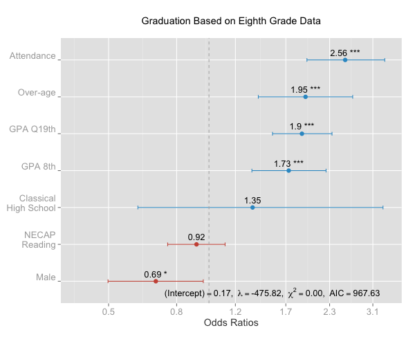

title: Getting Back on Track: Predicting High School Success Early
author: Jason P. Becker
email: jason_becker@brown.edu
date: 2013-04-11
keywords: 

# Getting Back on Track: Predicting High School Success Early

## Overview
Providence is in the process of implementing new Proficiency-Based Graduation Requirements (PBGR). This year, they have developed Personal Graduation Plans, which track student progress on the three major determinants of graduation: course credit accumulation, locally designed diploma assessments, and the state assessment. In addition to tracking requirements, the plans include several on-track indicators. When students are found to be off-track, educators develop a PBGR Student Progress Plan where individualized interventions are recorded and tracked.

But when off-track students are identified as they advance through high school, it may already be too late to get them on track. In this project, given that approximately 95% of first-time high school freshman attend a Providence public school in 8th grade, we aimed to develop an indicator that would predict high school graduation based on 8th-grade data. This new information about the incoming freshman class at each high school has the potential to be used for resource allocation and progress monitoring at an early enough stage to successfully intervene and support off-track students.

## Key Questions
1. Do the previously identified on-track indicators provide educators with information on student progress toward graduation as early and accurately as is needed? Using only data from 8th grade, can we predict high school graduation accurately for incoming freshmen in time for successful intervention?
2. What overall metric can be developed to best determine high, medium, and low likelihood of graduating?
3. What is the appropriate frequency for updating on-track measurement for students?
4. How can on-track indicators be expanded to assess and track readiness at all levels, from successful transitions to upper elementary school through college readiness?

## Models and Methods

### Data Source

The findings in this report are based on the cohort of students who entered high school for the first time in the 2007-2008 school year and were expected to graduate as members of the class of 2010. Students who transferred out of Providence Public Schools were excluded from this analysis since their outcomes are unknown[^transferout].

Because this report specifically examines eight grade determinants of future success, only students who attended Providence middle schools are included in the analysis[^middleschool].

### Methods
 
A conditional inference tree was developed to explore existing patterns in the data, revealing a complex relationship primarily between course performance, attendance, age, gender, and acceptance into the district's competitive magnet school. 

Logit regressions[^logit] were used to calculate the probability of graduating for each student. The quality of various models were compared using several methods, with the primary focus being the maximum Area Under the Curve (AUC) [^AUC] of Receiver-Operator characteristic curves and the Akaike information criterion (AIC) [^AIC].

The following characteristics were all tested for inclusion in the models:

* attendance (continuous and categorical)
* suspensions (number)
* course performance (overall GPA, GPA by each core subject, GPA by core v. non-core)
* NECAP performance (scale scores, proficiency levels)
* gender
* race
* free or reduced-price lunch eligibility
* Limited English proficiency status
* Individualized Education Plan
* student language
* parent language
* entering a magnet high school (Classical)
* age at high school entrance (days, months, years, and overage categorical)

Additionally, results from the first quarter of high school were included to the base model. Two questions motivate investigating this impact. First, how soon is it appropriate to monitor the progress of students who enter high school at risk of not graduating? If first quarter grades in high school add additional accuracy to graduation predictions, it suggests that a successful transition into high school from day one can partially mitigate incoming risk. This would also suggest that high risk students who are unsuccessful at early transitioning into high school find themselves at even greater risk.

### Assignment to High Risk

The results of these regression models are a predicted probability of achieving the desire outcome-- graduating high school. This report focuses on identifying students who are at high risk of failing to be successfully promoted to the tenth grade and those who are at *high risk* of failing to graduate. 

Assignment to *high risk* is defined using a cutoff for the predicted probabilities, below which students in our sample have not achieved successful outcomes. An optimal cutoff differentiates clearly between students who are likely to reach an outcome and those who are not with the least misclassification.

There are two distinct ways that misclassification can occur. [Table 1: Error](#table1) describes the two forms of error. Type I Error represents a "false positive", where a student is identified as having a high likelihood of success but does not achieve the desired outcome. Type II Error represents a "false negative", where a student is identified as having a low probability of success but does achieve the desired outcome. Broadly, Type I Error is considered more problematic since it likely leads to failing to provide services to a student who may have benefited. An accurate cutoff in this report's context achieves the lowest total error while minimizing Type I Error.

#### Table 1: Error [table1]
|             |          Probability        ||
Graduates?	  | Low 		  | High 		 |
 ------------ | :-----------: | :-----------:|
 No 		  | Accurate 	  | Type I Error |
 Yes		  | Type II Error | Accurate 	 |

## Findings

The partition tree model seeks to identify distinct groups in the data, recursively generating cutoffs for each of the inputs that distinguishes a binary outcome-- does this group of students ultimately graduate or not? Using this model is instructive for identifying potential attributes to include in a logit model.

The partition tree results, [Figure 1](#figure1) revealed several interesting patterns that informed the logit model specification. For example, there were two clear discontinuities in the "age in months" predictor at 167 and 192 months. These cutoffs represented at least 1 or 2 years over-aged when first entering high school. Within each group, typical age, over-aged by 1 year, and over-aged by 2 years, there was no differences based on age in months. Therefore, in the ultimate model, an over-aged categorical variable is used as a predictor. Additionally, race, IEP status, and LEP status do not appear on the partition tree, suggesting they are unable to meaningfully classify likelihood of graduating. This was confirmed when these terms were not found to provide additional information to the logit model. The other insight from the partition tree was that some indicators (like suspensions) were only effective at classifying students within a small group after controlling for many other characteristics. These indicators do not all appear in the logit model that produces the predicted probability of graduation. In a larger district where these characteristics may differentiate amongst a larger set of students, these factors would likely be included. However, there is insufficient variance amongst Providence students to reliably use these indicators within the prediction model.

#### Figure 1: Partition Tree Model of Graduation Based on Eighth Grade Data [figure1]

Predictability of graduation was primarily driven by six factors: gender, overall attendance, overall grade point average, NECAP reading scaled scores, being over-aged when first entering high school, and attending Classical High School, generated using a logit model[^accuracy].

#### Figure 2: Eighth Grade Model [figure2]

The coefficients presented here can be understood as the change in odds of graduating for each standard or unit change in attribute. For example, increased attendance by one standard deviation \\(\mu \approx 88\%\\), \\(\sigma \approx 10\%\\) is associated with being 2.79 times as likely to graduate. This is a particularly powerful predictor, given the large number of Providence students who are chronically absent, defined as missing 10% or more of time each year. A change in one point in eighth grade overall course performance is nearly as strong a predictor of high school graduation. Male students have 70% odds compared to females for graduating high school.

### Optimal Cutoffs

[Table 2: Accuracy Exemplar](#table2) demonstrates an example table of one possible cutoff. If all students with a probability greater than 0.3 are considered as having a "high" probability of graduating, [Table 2](#table2) represents the results of the prediction. In this case, 58.1% of incoming ninth grade students would be identified as having a high probability of graduating and ultimately achieve that outcome. This model also correctly identifies 10.6% of students as having a low probability of graduating who do not ultimately earn a diploma. The accuracy of the prediction, however, is determined by the remaining two cells, where predictions do not match outcomes.

#### Table 2: Accuracy Exemplar [table2]
|             |          Probability        ||
Graduates?	  | Low 		  | High 		 |
 ------------ | :-----------: | :-----------:|
 No 		  | 10.6% 	  	  | 30.2% 		 |
 Yes		  | 1.2% 		  | 58.1% 	 	 |

As in [Table 1](#table1),  the sum of the diagonal from the lower left to the upper right of [Table 2](#table2) represents the total error, \\(\epsilon\\). The upper right cell represents Type I Error, \\(\alpha\\), and the lower left cell represents Type II Error, \\(\beta\\). An ideal cutoff minimizes the total rate of misclassification with the lowest possible \\(\alpha\\) as previously discussed.

[Figure 3](#figure3) shows the accuracy of the model (\\(1-\epsilon)\\) plotted across the range of possible cutoffs and highlights the accuracy at \\(cutoff=0.5\\). This cutoff has 72% overall accuracy, and importantly, of those identified as *high risk* for failing to graduate, only 20% graduate, indicating these students are truly unlikely to graduate. [Figure 4](#figure4) shows the ROC with the calculated AUC (with 95% confidence interval) for this model. Generally, an AUC in the 0.8 to 0.9 range is considered a "good" test, or a "B" on an A-F scale.

#### Figure 3: Model Accuracy by Cutoff [figure3]

#### Figure 4: Receiver operator characteristic [figure4]

The proportion of incoming freshman at each high school who are at "high risk" of not graduating, given this definition, varies widely. [Figure 5](#figure5) has the proportion of incoming students at high risk by each high school, which varies from 0% to over 30%.

#### Figure 5: Incoming Class Risk [figure5]

### Adding First Quarter Performance

The [AIC](#AIC) of the model including first quarter course performance is \\(967.63\\), which is considerably below the base model with \\(AIC=1192\\). This improvement is so dramatic that it leaves little doubt that including first quarter course performance dramatically includes the model specification.

Comparing the AUC of the two models also demonstrates an improvement in the model. A bootstrap test was performed to compare the AUCs of the ROCs obtained in each of the models which tested the Null Hypothesis that the difference between the AUCs was 0. The Null Hypothesis is rejected at the \\(p=.001\\) level.

Finally, evaluating the overall accuracy at the same cutoff as the base model again demonstrates the superiority of predictions from a model including first quarter grades. The cutoff accuracy improves to 75.5%.

#### Figure 6: First Quarter Performance [figure6]

The difference between incoming ninth graders within the high risk (probability > 0.5) that graduate and those who do not is startling. Within the high risk group, those who do ultimately graduate have an average first quarter ninth grade overall GPAs of 1.59 while those who do not earn a 0.93.

## Recommendations and Findings

All of the characteristics previously identified by the district as leading indicators of high school readiness are associated with graduation even in the eighth grade. Factors like attendance and course performance prior to entering high school are predictive of graduation.

The use of tree-based models reveal complex patterns in the data. The complexity of this relationship is not well represented in regression models that are not tree-based.

The AUC of the ROC falls in the range of “good” tests (between 0.80 and 0.90) using data only from incoming ninth graders. Careful selection of a “cutoff” value for low likelihood to graduate can identify a set of students who would likely benefit from having PBGR Student Progress Plans from day one of high school.

Using logit regressions, multiple leading indicators can be described with a single metric that represents each student’s likelihood of graduating high school. Based on the findings from this preliminary model, I recommend identifying students with than a 0.5 probability of graduating as "high risk" for intervention. In our sample, this would identify 21.7% of incoming ninth grade students, or approximately 350 students as being in need of intervention.

Students who enter high school at high risk who ultimately graduate have first quarter grade point averages 1.7 times higher than those who do not. Waiting to write PGBR Student Progress Plans until after poor performance in the first quarter is already late.

## Next Steps

This analysis needs to be expanded to other key K-12 transitions: early literacy, late elementary preparedness for middle school transition, successful middle school transitions, and college readiness. All of the business rules utilized to calculate the predictive analytics should be documented for replication and automation. Process maps will be provided that suggest a high-level architecture to ensure the data is available to key decision-makers like principals, teachers, and interventionists in a timely fashion. Several alternative presentations of the data will be produced to provide several presentations of the data that are clear and effective at conveying meaning. 
A district and school-level tracking of readiness for high school success will be proposed that can be monitored over time to determine system effectiveness.

[^logit]: The interpretation of the coefficient of logistic regressions are a little less straightforward than those in a standard linear regression. Instead of directly interpreting \\(\beta\\), the coefficients of a logistic regression are transformed, \\(e^\beta\\). This value represents the change in "odds" associated with a unit change in a measure. For example, when \\(e^{\beta}=2\\), a unit change is associated with doubling the odds of the predicted outcome. For the sake of this report, the specific coefficients are unimportant to proper interpretation.

[^AIC]: The  Akaike information criterion (AIC) is calculated for each model. A lower AIC generally represents a better model fit, and calculating \\(exp(\frac{AIC_{i}-AIC_{f}}{2})\\) provides the probability that \\(AIC_{f}\\) is a better solution than \\(AIC_{i}\\).

[^AUC]: One method to assess the accuracy of predictions is by plotting a receiver operating characteristic (ROC) and computing the area under the curve (AUC) between the ROC and the x-axis. The AUC represents the probability that a randomly chosen positive outcome will be ranked higher than a randomly chosen negative outcome. A completely random model (no predictive power) would have \\(AUC=.5\\). The closer the AUC is to 1, the more accurate the model.

[^transferout]: For accountability purposes, Providence is responsible for all students which transfer into its high schools, but not held responsible for students who are confirmed to have transferred into other educational settings. Once models and measures are more firmly established an analysis can be conducted to better understand which students transfer out of the Providence Public School District. Until that analysis is conducted, the base assumption will be that students that transfer out have similar risk factors to those who remain or transfer into PPSD.

[^middleschool]: This represents 1385 students of the 1851 students who enrolled at any point in ninth grade for the first time in PPSD.

[^accuracy]: There are several specifications that have not been attempted yet that have been demonstrated to predict high school graduation in other contexts. Number of school moves (mobility), number of course failures, specific disability types, and socio-economic data at the census tract and/or block level will be attempted in the future.

